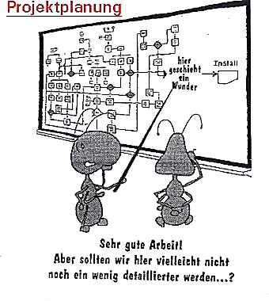

# Modul Tag 2 - Projekt Planung

---

Planung - Vorwissenaktivierung / PräInstruktion

#### 1. Wenn mehrere Personen zur Verfügung stehen, wie kann man als Projektleiter alle beteiligen?

Wenn man was augeteilt hat, kann man es mehreren Personen zuteilen.

#### 2. Ganz generell: Wie kann man einegrosse Aufgabe planen?

Kleine Schritte
In einzelne Blöcke aufteilen

WBS = Work Breakdown Structure

#### 3. Welche Planungsobjekte/-elemente sind zu planen?

#### 4. Was zeigt ein Gantt-Diagramm und wie könnte man es noch nennen?

Kann man auch als Zeitdiagramm nennen.

#### 5. Was bedeutet der "Kritische Pfad" in einer Aufgabenplanung?

---

[PDF Skript 2](./Skript_2_Projekt-Planung.pdf)

---

<iframe width="560" height="315" src="https://www.youtube.com/embed/JQYLg-n_iZE?si=sise4xUYPRNRABk0" title="YouTube video player" frameborder="0" allow="accelerometer; autoplay; clipboard-write; encrypted-media; gyroscope; picture-in-picture; web-share" referrerpolicy="strict-origin-when-cross-origin" allowfullscreen></iframe>

<iframe width="560" height="315" src="https://www.youtube.com/embed/9nliP9mefXo?si=kPYhrRUZpBefPECB" title="YouTube video player" frameborder="0" allow="accelerometer; autoplay; clipboard-write; encrypted-media; gyroscope; picture-in-picture; web-share" referrerpolicy="strict-origin-when-cross-origin" allowfullscreen></iframe>

<iframe width="560" height="315" src="https://www.youtube.com/embed/1wbtRrJiPVA?si=I1MYsAIXYOGxOJDT" title="YouTube video player" frameborder="0" allow="accelerometer; autoplay; clipboard-write; encrypted-media; gyroscope; picture-in-picture; web-share" referrerpolicy="strict-origin-when-cross-origin" allowfullscreen></iframe>

---

<iframe width="560" height="315" src="https://www.youtube.com/embed/HkXlzWYBBAU?si=gQS09q57Re222Vx6" title="YouTube video player" frameborder="0" allow="accelerometer; autoplay; clipboard-write; encrypted-media; gyroscope; picture-in-picture; web-share" referrerpolicy="strict-origin-when-cross-origin" allowfullscreen></iframe>

